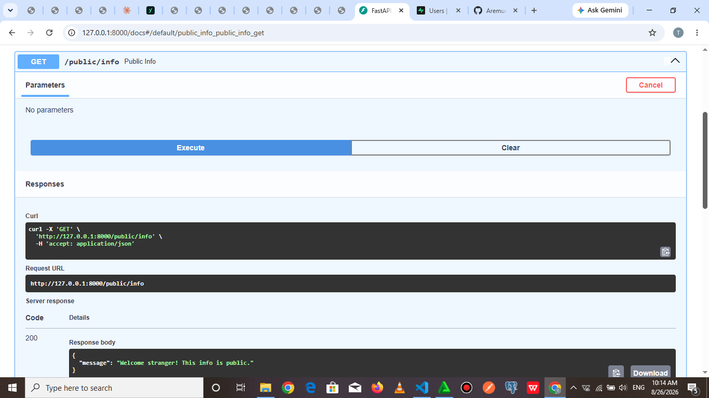

# Auth Login & Protect API

A secure FastAPI backend that handles user signup, login, and logout using
Supabase Auth, and protects specific routes using JWT bearer tokens.

## What this project does

This API demonstrates a standard authentication flow:
- Users sign up and log in through **Supabase Auth** (an external Identity Provider),
  which issues a JSON Web Token (JWT) on successful login.
- The client attaches that JWT to the `Authorization` header (`Bearer <token>`)
  on any request to a protected route.
- The server verifies the token with Supabase before allowing access to
  protected data.

The backend itself never stores or checks passwords directly — all credential
verification is delegated to Supabase.

## Setup

### 1. Clone the repository

\`\`\`bash
git clone <https://github.com/Aremuoluwatobi/supabase.git>
cd <C:\Users\Aremu\Documents\db assignment>
\`\`\`

### 2. Create a virtual environment and install dependencies

\`\`\`bash
python -m venv myenv
myenv\Scripts\activate      # Windows
pip install -r requirements.txt
\`\`\`

(If you don't have a `requirements.txt` yet, generate one with
`pip freeze > requirements.txt` before committing.)

### 3. Set up environment variables

Create a `.env` file in the project root (this file is gitignored and must
never be committed):

\`\`\`
SUPABASE_URL=https://your-project-id.supabase.co
SUPABASE_KEY=your_publishable_key
PORT=8000
\`\`\`

To get these values:
1. Create a free project at [supabase.com](https://supabase.com)
2. Go to **Project Settings → API**
3. Copy the **Project URL** and the **Publishable key**

A `.env.example` file is included in this repo showing the required variable
names with placeholder values.

### 4. Run the server

\`\`\`bash
uvicorn main:app --reload
\`\`\`

The API will be available at `http://localhost:8000`, and interactive docs
at `http://localhost:8000/docs`.

## API Reference

| Method | Route | Auth Required | Description |
|--------|-------|----------------|-------------|
| POST | /auth/signup | No | Create a new user account |
| POST | /auth/login | No | Authenticate a user and receive a JWT |
| POST | /auth/logout | Yes | End the current session |
| GET | /public/info | No | Public, unprotected data |
| GET | /protected/profile | Yes | Read the logged-in user's profile data |
| GET | /protected/dashboard | Yes | Example second protected route |

Protected routes require an `Authorization: Bearer <token>` header, where
`<token>` is the `access_token` returned by `/auth/login`.

## Testing with Swagger UI

1. Go to `http://localhost:8000/docs`
2. Log in via `/auth/login` to get an `access_token`
3. Click the **Authorize** button at the top of the page and paste the token
4. Try any protected route — the token is now attached automatically

## Notes

- This project uses Supabase as an Identity Provider rather than storing or
  hashing passwords directly — this is standard practice, since Supabase
  handles password security so the backend doesn't have to.
- On Windows PowerShell, use `curl.exe` (not the built-in `curl` alias, which
  is actually `Invoke-WebRequest` and handles headers differently).